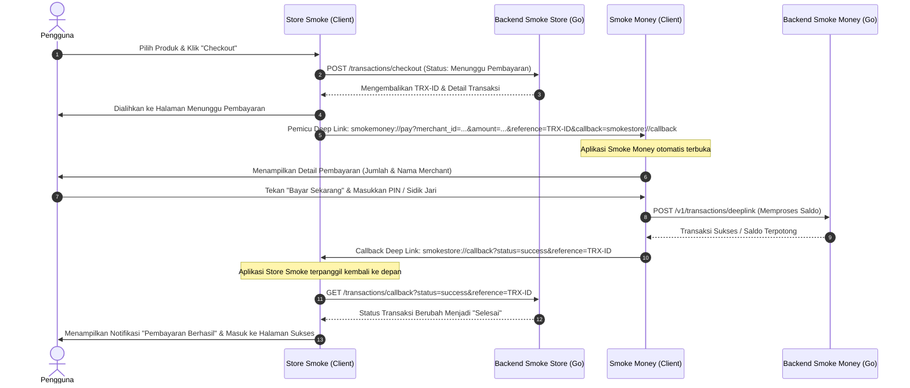

# Smoke Store & Smoke Money

* **Nama:** Sadam Irham Marami
* **NIM:** 1123150087
* **Kelas:** TIS SE P1
* **Mata Kuliah:** Pemrograman Mobile Lanjutan
* **Penilaian:** Ujian Akhir Semester (UAS) Semester 6 - Global Institute Bina Sarana Global

---

## 📌 Deskripsi Sistem

Sistem ini terdiri dari dua proyek aplikasi terintegrasi yang saling terhubung melalui mekanisme **Deep Linking (App Links)**:

1. **Store Smoke (`smoker-app-sadamirham`)**: Aplikasi e-commerce (toko) tempat pelanggan dapat memilih produk, memasukkannya ke dalam keranjang, dan melakukan proses checkout pesanan.
2. **Smoke Money (`project`)**: Aplikasi dompet digital (E-Money) bertindak sebagai penyedia pembayaran. Saat pelanggan memilih metode pembayaran "Smoke Money" di toko, aplikasi Smoke Money akan diluncurkan melalui skema deep link untuk memproses PIN, otentikasi biometrik, verifikasi 2FA, dan menyelesaikan transaksi.

---

## 🛠️ Arsitektur Proyek (Clean Architecture)

Kedua aplikasi dibangun dengan prinsip **Clean Architecture**, namun menggunakan pendekatan struktural yang berbeda:

### 1. Struktur Folder `Smoke Money` (Layer-First Approach)
Proyek ini dikelompokkan berdasarkan **Lapisan (Layer)** arsitektur secara global:
```
lib/
├── core/                 # Konfigurasi global, utilitas, tema, & rute
├── data/                 # Lapisan Data (DataSource, Model, Impl Repositori)
│   ├── datasources/      # Sumber data (local: SecureStorage, remote: Dio API)
│   ├── models/           # Parser respon JSON dari API
│   └── repositories/     # Implementasi repositori dari domain
├── domain/               # Lapisan Bisnis (Entitas, UseCase, Kontrak Repositori)
│   ├── entities/         # Objek bisnis murni bebas framework
│   ├── repositories/     # Interface kontrak data
│   └── usecases/         # Aksi bisnis (Payment, Transfer, OTP, Topup)
├── presentation/         # Lapisan UI (Halaman, Widget, Bloc)
│   ├── blocs/            # Pengelola state UI (AuthBloc, OtpBloc, dll.)
│   ├── pages/            # Seluruh tampilan layar aplikasi
│   └── widgets/          # Komponen UI reusable (Button, Field, dll.)
└── injection/            # Dependency Injection (Service Locator)
```

### 2. Struktur Folder `Store Smoke` (Feature-First Approach)
Proyek ini dikelompokkan berdasarkan **Fitur (Feature)** terlebih dahulu, di mana setiap fitur memiliki Clean Architecture-nya sendiri:
```
lib/
├── core/                 # Konstanta, tema, rute, & servis terpusat (Notification)
├── features/             # Kumpulan Fitur Independen
│   ├── auth/             # Fitur Autentikasi (Login, Register, Verify Email)
│   │   ├── data/         # Data layer khusus fitur auth
│   │   ├── domain/       # Domain layer khusus fitur auth
│   │   └── presentation/ # UI layer (Halaman & Provider) khusus fitur auth
│   ├── cart/             # Fitur Keranjang & Pembayaran (Cart, Checkout)
│   │   ├── data/         
│   │   ├── domain/       
│   │   └── presentation/ 
│   └── dashboard/        # Fitur Halaman Utama (Home, History, Profile)
│       ├── data/         
│       ├── domain/       
│       └── presentation/ 
└── main.dart             # Entry point aplikasi & inisialisasi state provider
```

---

## 🔗 Integrasi Pembayaran (Deep Linking)

Alur pembayaran antar aplikasi diintegrasikan secara mulus via custom scheme deep link:

* **Skema Pembayaran (`smokemoney://pay`)**:
  * Dipicu dari `Store Smoke` ke `Smoke Money` dengan parameter detail pesanan (`merchant_id`, `merchant_name`, `amount`, `reference`, dan `callback`).
  * Konfigurasi di Android dideklarasikan pada intent-filter berkas [AndroidManifest.xml](file:///home/nafisah/uas-sadam-1123150087/project/android/app/src/main/AndroidManifest.xml).
  
* **Skema Callback (`smokestore://callback`)**:
  * Dipicu dari `Smoke Money` kembali ke `Store Smoke` untuk mengirimkan status penyelesaian transaksi (`success`, `failed`, atau `cancelled`).

---

## 🔄 Alur Kerja Sistem (System Workflow)

Berikut adalah alur transaksi ujung-ke-ujung (end-to-end) antara aplikasi **Store Smoke** dan **Smoke Money**:



### Penjelasan Langkah Alur Kerja:

1. **Pemilihan & Checkout**: Pengguna berbelanja di aplikasi `Store Smoke`, menentukan item, dan melanjutkan ke halaman checkout.
2. **Pembuatan Transaksi Pending**: Setelah menekan tombol pembayaran, `Store Smoke` mengirim request pembuatan transaksi ke server backend `be-smoke-store`. Status awal transaksi diset menjadi **"Menunggu Pembayaran"**.
3. **Pemicu Deep Link**: Aplikasi `Store Smoke` memanggil URL Skema `smokemoney://pay` berisi data tagihan dan parameter callback. Pada saat yang sama, aplikasi toko menampilkan halaman *Awaiting Payment*.
4. **Pembukaan Dompet Digital**: OS Android menangkap skema `smokemoney` dan membuka aplikasi `Smoke Money`. Halaman konfirmasi pembayaran dimunculkan.
5. **Autentikasi Keamanan**: Pengguna memvalidasi pembayaran menggunakan **PIN**, **Sidik Jari (Biometrik)**, dan/atau **2FA** (sesuai setelan akun Smoke Money).
6. **Eksekusi Pengurangan Saldo**: Aplikasi `Smoke Money` mengirim perintah ke `be-smoke-money` untuk memotong saldo pengguna dan mentransfernya ke akun merchant.
7. **Callback ke Toko**: Setelah pembayaran berhasil, aplikasi `Smoke Money` memanggil URL Callback `smokestore://callback?status=success&reference=TRX-ID`.
8. **Sinkronisasi Akhir**: Aplikasi `Store Smoke` terbangun kembali, mendeteksi parameter sukses, melakukan update status pesanan ke `be-smoke-store` menjadi **"Selesai"**, memicu notifikasi lokal, dan menampilkan layar pembayaran sukses ke pengguna.

---

## 🚀 Cara Menjalankan Aplikasi

### Langkah 1: Jalankan Backend API
Pastikan kedua backend server (Go API) telah berjalan:
```bash
# Untuk backend Smoke Store
cd be-smoke-store
go run main.go

# Untuk backend Smoke Money
cd be-smoke-money
go run main.go
```

### Langkah 2: Jalankan Aplikasi Mobile (Flutter)
Jalankan aplikasi di perangkat emulator/fisik secara bersamaan:

```bash
# Jalankan aplikasi toko (Store Smoke)
cd smoker-app-sadamirham
flutter run

# Jalankan aplikasi dompet (Smoke Money)
cd project
flutter run
```
