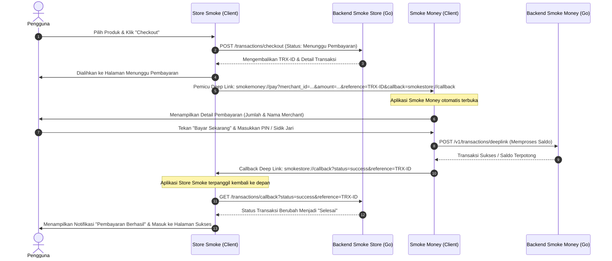

# Smoke Store & Smoke Money

* **Nama:** Sadam Irham Marami
* **NIM:** 1123150087
* **Kelas:** TIS SE P1
* **Mata Kuliah:** Pemrograman Mobile Lanjutan
* **Penilaian:** Ujian Akhir Semester (UAS) Semester 6 - Global Institute Bina Sarana Global

---

## 📌 Deskripsi Sistem

Sistem ini terdiri dari dua proyek aplikasi terintegrasi yang saling terhubung melalui mekanisme **Deep Linking (App Links)**:

1. **Store Smoke (`smoker-app-sadamirham`)**: Aplikasi e-commerce (toko) tempat pelanggan dapat memilih produk, memasukkannya ke dalam keranjang, dan melakukan proses checkout pesanan.
2. **Smoke Money (`project`)**: Aplikasi dompet digital (E-Money) bertindak sebagai penyedia pembayaran. Saat pelanggan memilih metode pembayaran "Smoke Money" di toko, aplikasi Smoke Money akan diluncurkan melalui skema deep link untuk memproses PIN, otentikasi biometrik, verifikasi 2FA, dan menyelesaikan transaksi.

---

## 🛠️ Arsitektur Proyek (Clean Architecture)

Kedua aplikasi dibangun dengan prinsip **Clean Architecture**, namun menggunakan pendekatan struktural yang berbeda:

### 1. Struktur Folder `Smoke Money` (Layer-First Approach)
Proyek ini dikelompokkan berdasarkan **Lapisan (Layer)** arsitektur secara global:
```
lib/
├── core/
│   ├── constants/        # Konstanta string, API, dan key secure storage
│   ├── error/            # Penanganan kesalahan/exception aplikasi
│   ├── network/          # Konfigurasi client HTTP (Dio Client & Interceptor)
│   ├── router/           # Navigasi terpusat berbasis GoRouter
│   ├── services/         # Layanan internal (biometrik & deep link)
│   ├── theme/            # Desain sistem & skema warna aplikasi
│   └── utils/            # Fungsi helper umum (formatter mata uang, dll.)
├── data/
│   ├── datasources/
│   │   ├── local/        # Akses Secure Storage untuk token JWT & biometrik
│   │   └── remote/       # Panggilan HTTP ke Endpoint API be-smoke-money
│   ├── models/           # Data Transfer Object (DTO) untuk parsing JSON API
│   └── repositories/     # Implementasi repositori penghubung datasource ke domain
├── domain/
│   ├── entities/         # Model data murni tanpa framework (User, Transaction)
│   ├── repositories/     # Abstraksi (interface) kontrak akses data
│   └── usecases/         # Logika bisnis inti (login, transfer, topup, verify 2fa)
├── presentation/
│   ├── blocs/            # Manajemen state UI menggunakan BLoC pattern
│   ├── pages/            # Layanan antarmuka layar (Login, Home, Topup, Transfer, PIN, 2FA)
│   └── widgets/          # Komponen widget UI kustom yang dapat digunakan kembali
├── injection/            # Konfigurasi Dependency Injection menggunakan GetIt
├── firebase_options.dart # Konfigurasi Firebase SDK
└── main.dart             # Entry point & inisialisasi awal aplikasi
```

### 2. Struktur Folder `Store Smoke` (Feature-First Approach)
Proyek ini dikelompokkan berdasarkan **Fitur (Feature)** terlebih dahulu, di mana setiap fitur memiliki Clean Architecture-nya sendiri:
```
lib/
├── core/
│   ├── constants/        # Konstanta warna, endpoint API toko, & teks statis
│   ├── guards/           # Proteksi rute (AuthGuard untuk memproteksi dashboard)
│   ├── routes/           # Routing aplikasi (AppRouter)
│   ├── services/         # Layanan lokal (local notifications, secure storage, biometrik)
│   ├── shared/           # Widget reusable global (custom button, textfield, dll.)
│   └── theme/            # Definisi tema visual utama aplikasi
├── features/
│   ├── auth/             # Fitur Autentikasi (Login, Register, Verify Email)
│   │   ├── data/         # Implementasi API & auth state lokal
│   │   ├── domain/       # Kontrak repositori & usecase auth
│   │   └── presentation/ # Halaman (LoginPage, RegisterPage) & ChangeNotifierProvider
│   ├── cart/             # Fitur Keranjang, Checkout, & Awaiting Payment
│   │   ├── data/
│   │   ├── domain/
│   │   └── presentation/ # Halaman (CartPage, CheckoutPage, AwaitingPaymentPage) & Provider
│   └── dashboard/        # Fitur Halaman Utama setelah Login (Home, History, Profile)
│       ├── data/
│       ├── domain/
│       └── presentation/ # Halaman (DashboardPage, HomePage, HistoryPage, ProfilePage) & Provider
├── firebase_options.dart # Konfigurasi Firebase SDK
└── main.dart             # Entry point & inisialisasi state provider terpusat (MultiProvider)
```

---

## 🔗 Integrasi Pembayaran (Deep Linking)

Alur pembayaran antar aplikasi diintegrasikan secara mulus via custom scheme deep link:

* **Skema Pembayaran (`smokemoney://pay`)**:
  * Dipicu dari `Store Smoke` ke `Smoke Money` dengan parameter detail pesanan (`merchant_id`, `merchant_name`, `amount`, `reference`, dan `callback`).
  * Konfigurasi di Android dideklarasikan pada intent-filter berkas `AndroidManifest.xml` proyek masing-masing.

* **Skema Callback (`smokestore://callback`)**:
  * Dipicu dari `Smoke Money` kembali ke `Store Smoke` untuk mengirimkan status penyelesaian transaksi (`success`, `failed`, atau `cancelled`).

---

## 🔄 Alur Kerja Sistem (System Workflow)

Berikut adalah alur transaksi ujung-ke-ujung (end-to-end) antara aplikasi **Store Smoke** dan **Smoke Money**:



### Penjelasan Langkah Alur Kerja:

1. **Pemilihan & Checkout**: Pengguna berbelanja di aplikasi `Store Smoke`, menentukan item, dan melanjutkan ke halaman checkout.
2. **Pembuatan Transaksi Pending**: Setelah menekan tombol pembayaran, `Store Smoke` mengirim request pembuatan transaksi ke server backend `be-smoke-store`. Status awal transaksi diset menjadi **"Menunggu Pembayaran"**.
3. **Pemicu Deep Link**: Aplikasi `Store Smoke` memanggil URL Skema `smokemoney://pay` berisi data tagihan dan parameter callback. Pada saat yang sama, aplikasi toko menampilkan halaman *Awaiting Payment*.
4. **Pembukaan Dompet Digital**: OS Android menangkap skema `smokemoney` dan membuka aplikasi `Smoke Money`. Halaman konfirmasi pembayaran dimunculkan.
5. **Autentikasi Keamanan**: Pengguna memvalidasi pembayaran menggunakan **PIN**, **Sidik Jari (Biometrik)**, dan/atau **2FA** (sesuai setelan akun Smoke Money).
6. **Eksekusi Pengurangan Saldo**: Aplikasi `Smoke Money` mengirim perintah ke `be-smoke-money` untuk memotong saldo pengguna dan mentransfernya ke akun merchant.
7. **Callback ke Toko**: Setelah pembayaran berhasil, aplikasi `Smoke Money` memanggil URL Callback `smokestore://callback?status=success&reference=TRX-ID`.
8. **Sinkronisasi Akhir**: Aplikasi `Store Smoke` terbangun kembali, mendeteksi parameter sukses, melakukan update status pesanan ke `be-smoke-store` menjadi **"Selesai"**, memicu notifikasi lokal, dan menampilkan layar pembayaran sukses ke pengguna.

---

## 🚀 Cara Menjalankan Aplikasi

### Langkah 1: Jalankan Backend API
Pastikan kedua backend server (Go API) telah berjalan:
```bash
# Untuk backend Smoke Store
cd be-smoke-store
go run main.go

# Untuk backend Smoke Money
cd be-smoke-money
go run main.go
```

### Langkah 2: Jalankan Aplikasi Mobile (Flutter)
Jalankan aplikasi di perangkat emulator/fisik secara bersamaan:

```bash
# Jalankan aplikasi toko (Store Smoke)
cd smoker-app-sadamirham
flutter run

# Jalankan aplikasi dompet (Smoke Money)
cd project
flutter run

```

## UI aplikasi Smoke Money & Store Smoke

* Tampilan UI
<p align="center">
  
  
  
  
</p>

## Link Repositories & Presentasi Youtube

### Github Repository

* [Store Smoke](https://github.com/SadamIRM/smoker-app-sadamirham.git) - Klik untuk melihat repositori Store Smoke

* [Smoke Money](https://github.com/SadamIRM/E-money-ku.git) - Klik untuk melihat repositori Smoke Money

* [Backend Store Smoke](https://github.com/SadamIRM/be-smoke-store.git) - Klik untuk melihat repositori Backend Api E-commerce

* [Backend Smoke Money](https://github.com/SadamIRM/be-E-Money-ku.git) - Klik untuk melihat repositori Backend Api E-Money

### Presentasi Youtube

* [Link Presentasi Youtube](https://youtu.com/) - Klik untuk melihat presentasi Youtube